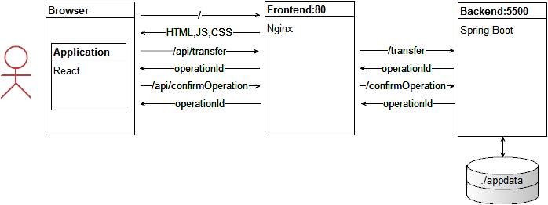
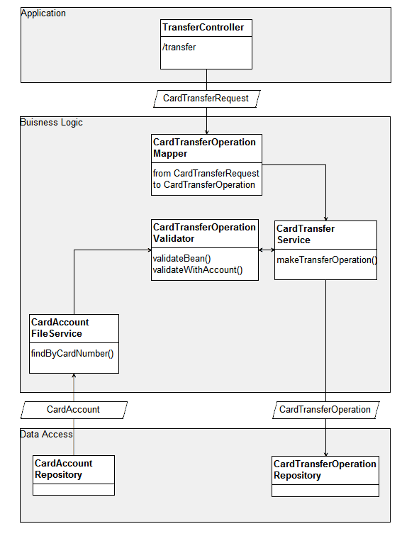
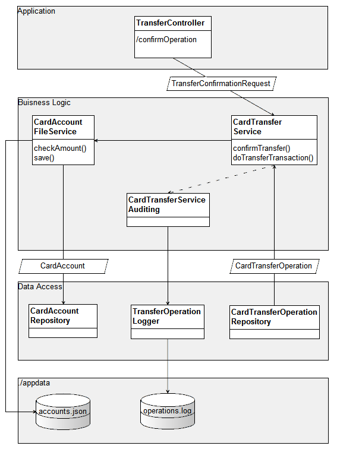

## Сервис перевода денег

Приложение запускается в Docker контейнере с именем `money-tranfer-rest`.
В процессе работы используется монтирование каталога хоста `./appdata`
для работы с данными и хранением логов.

При развитии приложения предусматривается переход от файлового хранилища к СУБД.
В таком случае будет улучшена поддержка транзакций и сохранность данных.

#### Данные о банковских картах

Загрузка данных о счетах происходит из файла `accounts.json` при запуске приложения.

В процессе работы происходит сохранение текущего состояния в файл,
заданный параметром `cardaccounts.export.filepath`. А результат транзакции
заносится в лог `operations.log`.

#### Формат `accounts.json`

Файл представляет из себя массив объектов с данными о счетах банковских карт.

```
[
  {
    "cardNumber":"1111222233334444",    // номер карты
    "validTill":"2026-12-31",           // последний день действия
    "cvv":"111",                        // секретный код
    "amount":10000,                     // средства на счете
    "limit":0,                          // лимит остатка (может быть отрицательныым)
    "currency":"RUR"                    // валюта счета
  }
]
```

#### Настройки `application.properties`

```
server.port=5500                                // сетевой порт приложения
operation.fee.multiplier=0.01                   // множитель комиссии
operation.currency.allowed=RUR                  // список разрешенных валют
operation.log.filepath=appdata/operations.log   // путь к лог-файлу транзакций
operation.log.enabled=true                      // разрешение записи в лог
cardaccounts.import.filepath=appdata/accounts.json        // источник данных о счетах
cardaccounts.export.filepath=appdata/accounts-last.json   // последнее состояние счетов
```

> Для удобства тестирования загрузка и сохранение данных об аккаунтах
> происходит в разные файлы. Для сохранения данных между запусками
> приложения следует указать одинаковое значение.

#### Сборка проекта:

Сборка проекта выполняется вместе с запуском docker-compose в корне проекта.

Для сборки только backend следует выполнить:

```
docker build -t kvbdev/money-transfer-rest .
```

#### Запуск интеграционных тестов:

Интеграционные тесты активируются в отдельном maven профиле `integration`.
Это позволяет пропустить их выполнение на этапе сборки артефакта
и обойтись юнит-тестами.

Для запуска полного тестирования c TestContainers следует выполнить команду:

```
mvn verify -Pintegration
```

В результате в папке `./appdata` появятся или обновятся файлы.

- `operations.log` содержит лог транзакций
- `accounts-last.json` содержит последнее состояние аккаунтов.

#### Запуск приложения

```
docker-compose up -d
```

После запуска всего приложения, оно начнет отвечать на `80` порту.
При этом запросы на `/api` эндпоинт перенаправляются к backend части.



Для удобства тестирования Backend должен быть доступен по локальному адресу
[http://localhost:5500](http://localhost:5500).

#### Примеры запросов

```
// Регистрация транзакции
curl -H "Content-Type: application/json" -d '{"cardFromNumber": "1111111111111111","cardToNumber": "2222222222222222","cardFromCVV": "111","cardFromValidTill": "12/99","amount": {"currency": "RUR","value": 100000}}' "http://localhost:5500/transfer"

// Ответ:
{"operationId":"b81399dc-f518-49f7-8288-250a1309d6f4"}
```

```
// Подтверждение транзакции
curl -H "Content-Type: application/json" -d '{"code": "0000","operationId": "b81399dc-f518-49f7-8288-250a1309d6f4"}' "http://localhost:5500/confirmOperation"

// Ответ:
{"operationId":"b81399dc-f518-49f7-8288-250a1309d6f4"}
```

```
// Повторное подтверждение
curl -H "Content-Type: application/json" -d '{"code": "0000","operationId": "b81399dc-f518-49f7-8288-250a1309d6f4"}' "http://localhost:5500/confirmOperation"

// Код ошибки 500:
{"id":0,"message":"Перевод уже был подтвержден."}
```

#### Схема работы запроса `/transfer`



#### Схема работы запроса `/confirmOperation`


